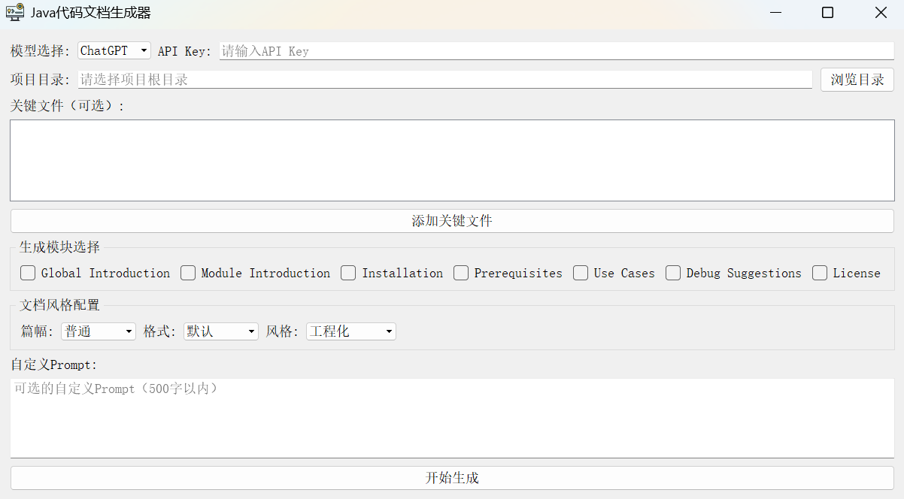
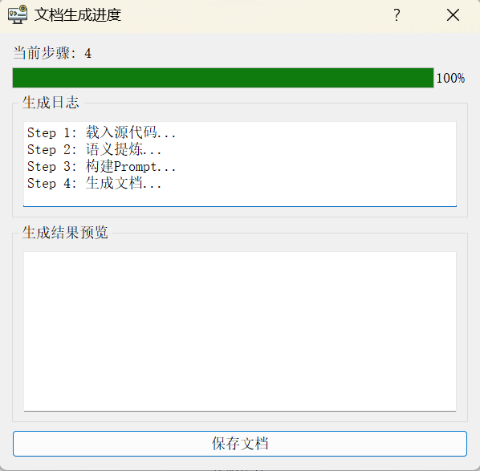

# Code Context Augmented Code Summarization Model

This repository is to build code document generation client on Windows.

The interface prototype of the tool is:

The generating result prototype of the tool is:

